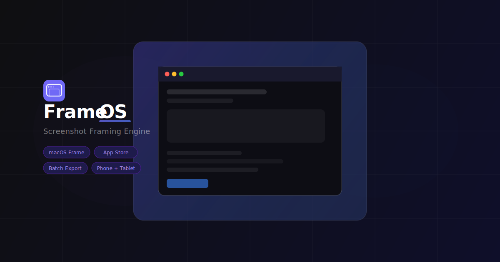

<div align="center">

<!-- Logo & Title -->


<br/><br/>

# FrameOS

**Screenshot Framing Engine** — wrap any screenshot in a stunning frame and export it at exact App Store or Google Play dimensions.

<br/>

<!-- Badges row 1 — status -->
[](https://vercel.com/new/clone?repository-url=https://github.com/Daniel-wambua/frameOS)
[](https://github.com/Daniel-wambua/frameOS)
[](LICENSE)

<!-- Badges row 2 — stack -->
[](https://nextjs.org)
[](https://react.dev)
[](https://typescriptlang.org)
[](https://tailwindcss.com)
[](https://github.com/bubkoo/html-to-image)

<!-- Badges row 3 — quality -->
[](https://github.com/Daniel-wambua/frameOS/actions)
[](https://github.com/Daniel-wambua/frameOS/pulls)
[](package.json)
[](https://frameos.app)

<br/>

</div>

---

## ✨ What is FrameOS?

FrameOS is a **free, browser-based** screenshot framing tool. Upload a screenshot (or up to 10 at once), pick a frame, tweak the background  and canvas settings, then export as a pixel-perfect PNG — straight to your downloads or clipboard.

No sign-up. No server uploads. Everything runs **entirely client-side**.

---

## 🚀 Features

| Feature | Details |
|---|---|
| **6 Frame Styles** | macOS, Windows 11, Minimal, Browser (Chrome), Phone (Samsung Galaxy), Tablet (iPad) |
| **App Store Formats** | 6.7" (1290×2796), 6.5" (1242×2688), 5.5" (1242×2208) — required sizes |
| **Google Play Formats** | Standard 9:16 (1080×1920), Galaxy tall 9:20 (1080×2400) |
| **Batch Processing** | Load up to 10 images, navigate via thumbnail strip, export all in one click |
| **Gradient Backgrounds** | 4 built-in gradients (Cosmic, Sunset, Forest, Midnight) + solid colour picker |
| **Canvas Controls** | Image scale (50–100%), padding (8–64 px), corner radius (0–32 px) |
| **Export Options** | Download PNG, Export All, Copy to Clipboard |
| **Undo Stack** | 20-level undo for all config changes (`Ctrl/Cmd+Z`) |
| **Dark / Light Mode** | Full site theme toggle, independent from frame theme |
| **Keyboard Shortcuts** | `←` `→` navigate · `E` export · `Ctrl+Z` undo |
| **SEO Ready** | Full Open Graph, Twitter Card, sitemap, robots.txt, Web App Manifest |
| **Zero Server** | All image processing is done in the browser — your images never leave your device |

---

## 🖥️ Frame Gallery

<table>
  <tr>
    <td align="center"><b>macOS</b><br/><sub>Traffic-light chrome</sub></td>
    <td align="center"><b>Windows 11</b><br/><sub>Fluent title bar</sub></td>
    <td align="center"><b>Minimal</b><br/><sub>Shadow card</sub></td>
  </tr>
  <tr>
    <td align="center"><b>Browser</b><br/><sub>Chrome-style tab</sub></td>
    <td align="center"><b>Phone</b><br/><sub>Samsung Galaxy · slim bezels</sub></td>
    <td align="center"><b>Tablet</b><br/><sub>iPad · wide bezel</sub></td>
  </tr>
</table>

---

## ⚡ Quick Start

```bash
# 1. Clone the repo
git clone https://github.com/Daniel-wambua/frameOS.git
cd frameos

# 2. Install dependencies
npm install

# 3. Start the dev server
npm run dev
```

Open [http://localhost:3000](http://localhost:3000) — that's it.

---

---

## 🎯 Store Screenshot Dimensions

FrameOS exports at the **exact pixel dimensions** required by the stores when a preset is selected:

### Apple App Store
| Size | Device | Dimensions | Status |
|------|--------|-----------|--------|
| 6.7" | iPhone 15 Pro Max | **1290 × 2796 px** | ✅ Required |
| 6.5" | iPhone 14 Plus | **1242 × 2688 px** | ✅ Required |
| 5.5" | iPhone 8 Plus | **1242 × 2208 px** | Legacy |

### Google Play Store
| Size | Device | Dimensions |
|------|--------|-----------|
| Standard 9:16 | Android | **1080 × 1920 px** |
| Galaxy tall 9:20 | Galaxy S24 Ultra | **1080 × 2400 px** |

---

## ⌨️ Keyboard Shortcuts

| Key | Action |
|-----|--------|
| `←` / `→` | Navigate batch images |
| `E` | Export current image |
| `Ctrl` + `Z` | Undo last config change |

---

## 🛠️ Tech Stack

- **[Next.js 15](https://nextjs.org)** — App Router, static export, auto-favicon/sitemap
- **[React 19](https://react.dev)** — `useCallback`, `useRef`, `forwardRef` for the capture target
- **[TypeScript 5.7](https://typescriptlang.org)** — strict mode throughout
- **[Tailwind CSS 3.4](https://tailwindcss.com)** — `darkMode: 'class'` strategy
- **[html-to-image](https://github.com/bubkoo/html-to-image)** — DOM-to-PNG capture (dynamically imported, keeps SSR bundle clean)

### Key implementation notes

- **Data URLs, not blob: URLs** — images are stored as base64 at upload time so `html-to-image` can embed them directly without re-fetching. Blob URLs fail when a cache-busting query string is appended.
- **Inline CSS gradients** — Tailwind's JIT scanner can't detect dynamically assembled class strings, so all gradient backgrounds use raw `linear-gradient()` via `style={{ background }}`.
- **Keyboard shortcuts via stable refs** — `handleExport` and `handleUndo` are stored in refs so the `keydown` effect doesn't need to re-register on every state change.

---

## 🚢 Deploy to Vercel

[](https://vercel.com/new/clone?repository-url=https://github.com/Daniel-wambua/frameOS)

1. Push this repo to GitHub
2. Import it at [vercel.com/new](https://vercel.com/new)
3. Vercel auto-detects Next.js — no configuration needed
4. Assign your domain and update the `metadataBase` URL in `app/layout.tsx` and `app/sitemap.ts`

```bash
# Manual deploy via Vercel CLI
npx vercel --prod
```

---

## 🤝 Contributing

Pull requests are welcome.

```bash
# Run type-check before committing
npm run build
```

---

## 📄 License

<details>
<summary><b>MIT License — click to expand</b></summary>

<br/>

```
MIT License

Copyright (c) 2026 Daniel Wambua

Permission is hereby granted, free of charge, to any person obtaining a copy
of this software and associated documentation files (the "Software"), to deal
in the Software without restriction, including without limitation the rights
to use, copy, modify, merge, publish, distribute, sublicense, and/or sell
copies of the Software, and to permit persons to whom the Software is
furnished to do so, subject to the following conditions:

The above copyright notice and this permission notice shall be included in all
copies or substantial portions of the Software.

THE SOFTWARE IS PROVIDED "AS IS", WITHOUT WARRANTY OF ANY KIND, EXPRESS OR
IMPLIED, INCLUDING BUT NOT LIMITED TO THE WARRANTIES OF MERCHANTABILITY,
FITNESS FOR A PARTICULAR PURPOSE AND NONINFRINGEMENT. IN NO EVENT SHALL THE
AUTHORS OR COPYRIGHT HOLDERS BE LIABLE FOR ANY CLAIM, DAMAGES OR OTHER
LIABILITY, WHETHER IN AN ACTION OF CONTRACT, TORT OR OTHERWISE, ARISING FROM,
OUT OF OR IN CONNECTION WITH THE SOFTWARE OR THE USE OR OTHER DEALINGS IN THE
SOFTWARE.
```

</details>

---

<div align="center">

Made with ♥ by HAVOC

[](https://github.com/Daniel-wambua/frameOS)

</div>
